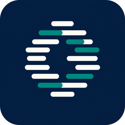
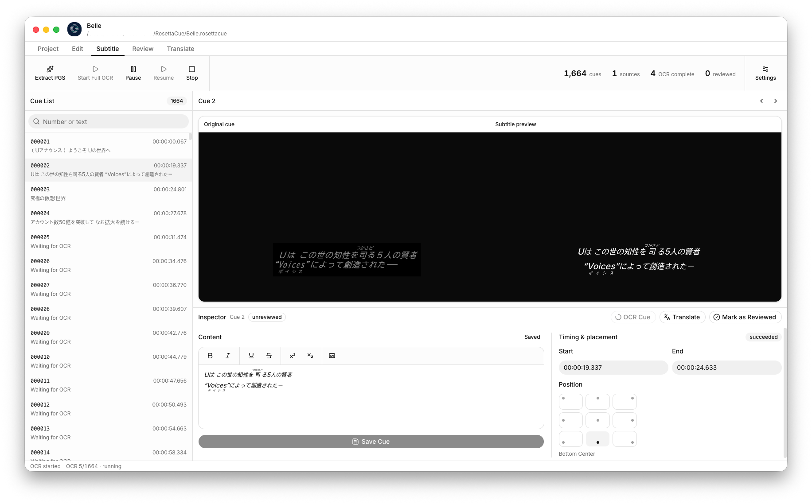
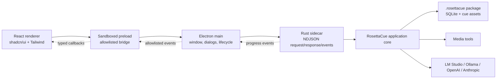

<div align="center">



# RosettaCue

**Turn Blu-ray image subtitles into verifiable text.**



RosettaCue extracts PGS subtitle streams from a Blu-ray backup, recognizes them
with the multimodal LLM of your choice, and gives you a real editor to review,
style, translate, and export the result — entirely on your own machine.

[](https://github.com/everettielle/RosettaCue/actions/workflows/ci.yml)
[](LICENSE)
[](#building-a-release)

[Documentation](#documentation) · [Quick start](#quick-start) · [Contributing](CONTRIBUTING.md) · [Changelog](CHANGELOG.md)

</div>

---

## The problem

Blu-ray subtitles are not text. They are PGS — a stream of timed bitmaps. To get
usable subtitles you have to OCR pictures of words, and classical OCR engines
fail badly on stylized subtitle typography, especially Japanese with furigana.
The usual result is a `.srt` full of `ー`/`一` confusions, dropped second lines,
and lost ruby annotations, with no record of what the machine actually saw.

RosettaCue treats that as an **evidence problem** rather than a conversion
problem. Every recognition attempt is kept. Every human edit is appended, never
overwritten. Approval is bound to the exact revision it approved, and is
invalidated the moment that revision changes. You end up with a subtitle file you
can defend, not just one you hope is right.

## What it does

```
Blu-ray backup  ──▶  PGS extraction  ──▶  LLM OCR  ──▶  human review  ──▶  translation  ──▶  export
   BDMV/               timed cue           structured     styled edit        revision        JSON + SRT
   CERTIFICATE         bitmaps             recognition    + approval         (optional)
```

- **Blu-ray source analysis.** Point RosettaCue at a BDMV backup directory; it
  lists titles, playlists, durations, and PGS streams before touching anything.
- **PGS extraction.** Demuxes a selected stream to `.sup`, decodes every
  presentation set to a PNG cue with exact timing and canvas geometry, and
  publishes cues to the UI incrementally so you can start reviewing before
  extraction finishes.
- **LLM OCR with verification.** A selectable pipeline recognizes main text and
  ruby annotations either together or in consecutive, independently configured
  vision passes, then conservatively classifies whole-Cue italics and clear
  non-white text color. Every phase is schema-validated with bounded corrective
  retries. Before the first request, a foreground-pixel projection
  estimates how many large glyph rows the bitmap actually contains, and a
  response whose line count disagrees is rejected. That single check kills the
  most common silent failure: a syntactically perfect one-line answer for a
  two-line cue.
- **A real editor.** Selection-based bold, italic, underline, strikethrough,
  superscript, subscript, and font color. Ruby (furigana) creation with over/under placement.
  Timing editing and direct 3×3 position selection. Side-by-side rendering of the
  source bitmap and your structured subtitle in one shared canvas coordinate
  system, so position and scale are actually comparable.
- **Translation.** Translate a cue or a whole track into a target language,
  preserving timing and semantic position. Project-scoped proper-noun mappings
  are injected into every translation prompt so names stay consistent without
  leaking into another project. Use **Save As** first to keep the source
  language as its own project.
- **Review workflow.** Viewable Cue revision history with restore and guarded
  deletion, visible per-Cue revision counts, revision-based undo/redo, toggleable
  approval, and automatic invalidation when new evidence arrives. Cue List
  styling distinguishes pending OCR, review-pending, and reviewed Cues.
- **Export.** Canonical JSON that retains geometry, ruby, per-span styles, review
  status, and OCR provenance — plus derived SRT with portable `<b>`/`<i>`/`<u>`
  markup and explicit warnings for everything SRT cannot represent.

## Local-first by design

RosettaCue has no account, no cloud sync, and no telemetry. A project is a
`.rosettacue` directory package on your disk containing a SQLite database and the
cue assets. You choose which model provider sees your images:

| Provider          | Runs    | Notes                                                          |
| ----------------- | ------- | -------------------------------------------------------------- |
| **LM Studio**     | Locally | OpenAI-compatible endpoint, default `http://127.0.0.1:1234/v1` |
| **Ollama**        | Locally | OpenAI-compatible endpoint                                     |
| **OpenAI API**    | Remote  | Cue images leave your machine                                  |
| **Anthropic API** | Remote  | Cue images leave your machine                                  |

Text OCR, ruby, style, and translation are configured as independent profiles.
By default, Text OCR recognizes characters and ruby together before the Style
phase. Enabling the separate Ruby phase runs main-text recognition first, Ruby
recognition second, and Style recognition third. The Ruby profile can use the
same vision model as Text OCR or a dedicated model tuned for small annotations.
Translation runs afterward on text. API keys live in renderer memory for the session only;
they are never written to the project package, preferences, logs, or exports.

### Remote model cost

Cue images are tightly cropped to the glyph bounding box, not full frames, so a
typical cue costs a few hundred image tokens rather than a few thousand. Across
a two-hour film the recurring instruction text — stage guidance plus the response
schema, identical for every cue — dominates the image, so RosettaCue sends it as
a cacheable prefix and keeps only the row estimate and recognized lines in the
per-cue turn.

Because the profiles are independent, the cheap stages can run on a cheap model.
Style recognition is a two-value classification and does not need a frontier
model; translation benefits from one.

OpenAI reasoning models bill reasoning tokens at the output rate, and the
server-side default is not `none`. OCR gains nothing from deliberation, so every
OpenAI profile defaults to `reasoning_effort: none` — leaving it unset is the
single largest avoidable cost on that provider. Override per run with
`--reasoning-effort`, or per profile in Settings → Models.

Enable debug logging to see per-stage `input_tokens`, `output_tokens`,
`cache_read_input_tokens`, and `reasoning_tokens`; measure a short run before
committing to a model rather than extrapolating from published rates.

## Status

**Pre-1.0.** The project format is at schema version 1 and RosettaCue ships **no
migration code** — a package written by a different schema version is rejected
rather than silently upgraded. This is deliberate while the format stabilizes.
Do not use RosettaCue for archival work you cannot redo.

## Requirements

|             |                                                                             |
| ----------- | --------------------------------------------------------------------------- |
| Node.js     | 24 or newer                                                                 |
| pnpm        | 11.20.0, via Corepack                                                       |
| Rust        | 1.97.1 or newer (edition 2024)                                              |
| Media tools | `bd_list_titles`, `bd_splice`, `ffmpeg` — see below                         |
| Platform    | macOS, Windows, or Linux, plus the usual Electron and Rust build toolchains |

### Media tools

Source analysis and extraction shell out to three external executables.
RosettaCue does not bundle them in this repository:

- `bd_list_titles` and `bd_splice` — example utilities from
  [libbluray](https://www.videolan.org/developers/libbluray.html) (LGPL-2.1)
- `ffmpeg` — [FFmpeg](https://ffmpeg.org/) (LGPL/GPL depending on build)

Put them on your `PATH`, or stage them in `resources/tools/` where the packaging
step and the `ROSETTACUE_MEDIA_TOOLS_DIR` environment variable can find them.
Check what RosettaCue currently resolves with **Settings → General → media tool
diagnostics**, or from the CLI:

```bash
cargo run -p rosettacue-cli -- doctor
```

## Quick start

```bash
git clone https://github.com/everettielle/RosettaCue.git
cd RosettaCue
corepack enable
corepack pnpm install
corepack pnpm dev
```

`pnpm dev` builds the debug Rust sidecar and starts Vite with the Electron
plugin. The desktop app opens on the Welcome window; create a project, add a
Blu-ray backup directory as a source, extract a PGS track, and run OCR.

To preview the renderer in a plain browser — useful for UI work — run
`corepack pnpm dev:web`. Desktop-only actions will report that the Electron
bridge is unavailable, which is expected.

## Architecture

Three boundaries, kept strict:

1. **The React renderer** owns presentation and transient draft state.
2. **Electron** owns native desktop capability and the sidecar process lifecycle.
3. **Rust** owns every project, subtitle, OCR, translation, and export behavior.



The renderer never receives Node.js, filesystem, process, or raw Electron access.
`contextIsolation` is on, `nodeIntegration` is off, and the window is sandboxed.
The renderer can only:

- invoke a fixed, allowlisted list of Rust backend methods;
- subscribe to a fixed, allowlisted list of progress events;
- request a project or directory through a native Electron dialog.

Electron and Rust talk over newline-delimited JSON on stdin/stdout. Standard
output is protocol-only; structured diagnostic entries use the same event
envelope instead of writing free-form text. Request IDs allow concurrent
out-of-order completion, and a single Rust writer thread serializes every
response and event so JSON can never interleave.

```json
{ "id": "a1", "method": "backend_info", "params": {} }
{ "id": "a1", "result": { "name": "RosettaCue Core", "version": "0.1.0" } }
{ "event": "ocr-progress", "payload": { "phase": "cue-complete", "current": 8, "total": 1644 } }
```

### Debug logging

Settings → Advanced can enable application-wide debug logging. When enabled,
Electron records IPC, backend lifecycle, project mutations, media extraction,
OCR and translation stages, and provider HTTP exchanges in rotating session
JSONL files under the application data directory. The Debug Log opens in a
separate resizable window so it can remain visible while reproducing a problem.

Provider response entries retain the HTTP status, safe response headers, and
the complete response body before content parsing. API keys, authorization
headers, cookies, image base64, and binary payloads are always redacted. Logs
may still contain project text, local paths, and model responses, and enabling
them can reduce performance and increase disk usage.

You can drive the sidecar by hand — it is just a line protocol:

```bash
cargo build -p rosettacue-backend
target/debug/rosettacue-backend
# then type one JSON object per line
```

## Command-line interface

`apps/cli` is a sibling adapter over the same application core as the Electron
sidecar. Neither can bypass the core to touch project records directly.

```bash
cargo run -p rosettacue-cli -- doctor
cargo run -p rosettacue-cli -- project create ~/Subs/Belle.rosettacue --name Belle
cargo run -p rosettacue-cli -- source inspect /Volumes/BELLE
cargo run -p rosettacue-cli -- source attach ~/Subs/Belle.rosettacue /Volumes/BELLE
cargo run -p rosettacue-cli -- source extract ~/Subs/Belle.rosettacue <source-id> --title 1
cargo run -p rosettacue-cli -- ocr run ~/Subs/Belle.rosettacue \
  --provider lm-studio --model <model-id> --language jpn
cargo run -p rosettacue-cli -- ocr run ~/Subs/Belle.rosettacue \
  --provider lm-studio --model <text-model-id> --language jpn \
  --separate-ruby --ruby-model <ruby-model-id>
cargo run -p rosettacue-cli -- export ~/Subs/Belle.rosettacue --output ~/Subs --format srt
```

Remote providers read their key from an environment variable you name with
`--api-key-env`; the key is never taken as a literal argument. In separate mode,
Ruby options inherit the main Text OCR profile when the provider is omitted or
matches the main provider. Selecting a different Ruby provider uses that
provider's default endpoint and requires its own model and, when applicable,
credentials.

## Repository layout

```text
RosettaCue/
├── apps/
│   ├── backend/          Rust NDJSON sidecar launched by Electron
│   └── cli/              Standalone Rust CLI over the same core
├── crates/
│   ├── domain/           Shared subtitle, cue, and provider types
│   ├── project/          .rosettacue package layout, SQLite schema, transactions
│   ├── bluray/           BDMV inspection and PGS demux via media tools
│   ├── pgs/              SUP segment parsing, RLE decode, PNG generation
│   ├── llm/              Provider protocol abstraction
│   ├── ocr/              OCR pipeline, prompting, validation, JA normalization
│   ├── translation/      Structured subtitle translation
│   ├── export/           Canonical document assembly, JSON and SRT writers
│   └── core/             Application use-case orchestration
├── electron/             Main process, sandboxed preload, IPC contracts, sidecar client
├── messages/             Paraglide source message catalogs (English only for now)
├── project.inlang/       Paraglide/Inlang locale and message-format configuration
├── src/                  React renderer
│   ├── components/ui/    shadcn-managed component source
│   ├── features/         welcome, projects, settings, workspace
│   ├── lib/              renderer adapters and helpers
│   ├── paraglide/         Generated, git-ignored type-safe message runtime
│   └── types/            preload bridge declarations
├── docs/                 Architecture and full system specification
├── build/                Desktop package icons
└── resources/tools/      Media-tool staging directory (not committed)
```

## Development

```bash
corepack pnpm typecheck   # TypeScript contract and component checking
corepack pnpm lint        # renderer and Electron static analysis
corepack pnpm test        # Vitest + the full Rust workspace test suite
corepack pnpm format      # Prettier
```

Renderer strings use Paraglide JS. English is the only configured locale and
`messages/en.json` is the source catalog. Vite regenerates the git-ignored
`src/paraglide/` runtime during development and builds; run
`corepack pnpm i18n:compile` directly after changing locale configuration when
you want to refresh its generated types immediately.

Rust tests cover domain classification, PGS parsing and decoding, exact project
schema validation and transactions, OCR normalization, provider request formats,
translation structure, export generation, and OCR controller behavior. Run them
alone with `cargo test --workspace`. Clippy runs at `pedantic`, and `unsafe_code`
is forbidden workspace-wide.

The renderer uses shadcn/ui preset `b27GcrRo` (`base-rhea` style, Base UI
primitives, neutral base color, Inter Variable, Lucide icons, Tailwind CSS 4).
See [CONTRIBUTING.md](CONTRIBUTING.md) for the UI rules — the short version is
compose existing shadcn components, use semantic theme tokens rather than
component-level light/dark overrides, and use Base UI's `render` prop rather than
Radix's `asChild`.

## Building a release

```bash
corepack pnpm build     # release Rust sidecar + Electron/renderer bundles
corepack pnpm package   # electron-builder artifact for the host platform
```

Artifacts land in `release/`. Targets are DMG and ZIP on macOS, NSIS on Windows,
and AppImage and DEB on Linux. Because the Rust sidecar and the media tools are
native executables, **packaging is architecture-specific** — build each target on
a matching runner or set up an explicit cross-compilation pipeline. Media-tool
licenses and notices must ship with any public build.

## Documentation

- **[docs/specification.md](docs/specification.md)** — the complete system
  specification: ERD, workflows, UML, state machines, IPC and event catalogs,
  persistence rules, invariants, and UI behavior.
- **[docs/architecture.md](docs/architecture.md)** — the shorter tour of runtime
  topology, security model, and packaging boundaries.
- **[CONTRIBUTING.md](CONTRIBUTING.md)** — development setup and conventions.
- **[SECURITY.md](SECURITY.md)** — vulnerability reporting.

## Legal

RosettaCue reads **decrypted Blu-ray backup directories** that you supply. It
contains no decryption code, no AACS or BD+ handling, and no copy-protection
circumvention of any kind, and it will not acquire any for you. Producing the
backup, and doing anything with the subtitles you extract from it, is your
responsibility under the copyright law of your jurisdiction. Ripping or
redistributing content you do not own the rights to is illegal in many countries.

The bundled-media-tool workflow depends on third-party software under its own
licenses (libbluray is LGPL-2.1; FFmpeg is LGPL or GPL depending on the build).
If you redistribute a packaged RosettaCue build containing those binaries, you
must comply with their terms and include their notices.

## Contributing

Issues and pull requests are welcome — see [CONTRIBUTING.md](CONTRIBUTING.md) and
the [Code of Conduct](CODE_OF_CONDUCT.md). Good first areas: additional export
formats (ASS and WebVTT are both designed for but not implemented), non-Japanese
language normalization rules, and provider coverage.

## License

[MIT](LICENSE) © Everett Lee
