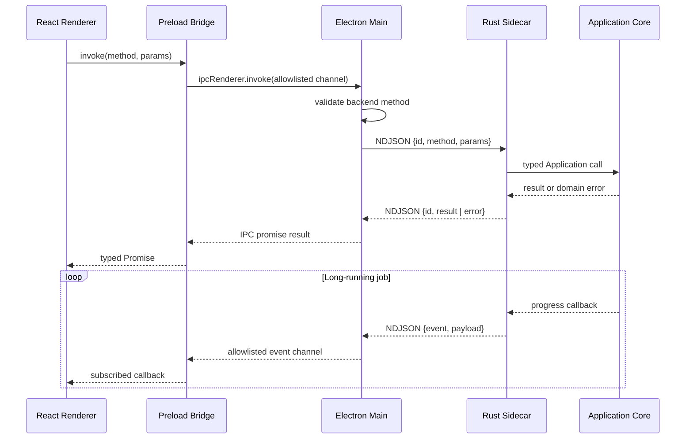
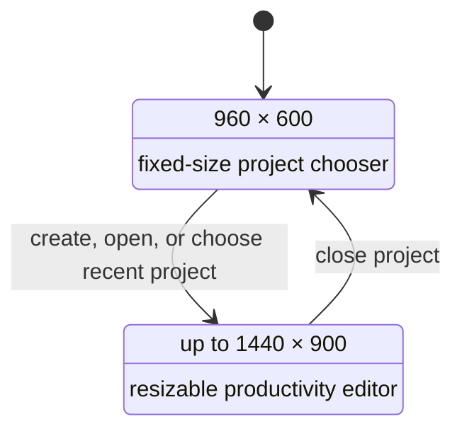
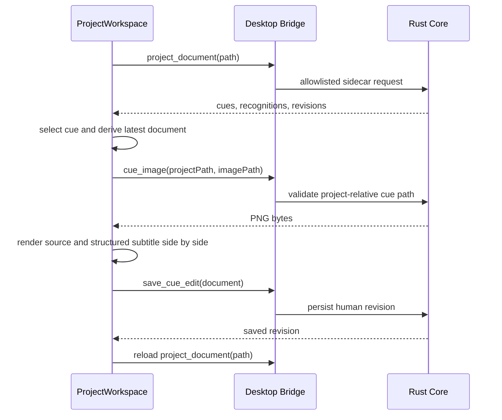

# RosettaCue Architecture

A tour of the runtime topology, security model, and packaging boundaries. For
the complete system design — ERD, workflows, UML, state machines, IPC catalogs,
persistence rules, and invariants — see [specification.md](specification.md).

## Goals

RosettaCue pairs an Electron desktop shell with a Rust application core. The
desktop shell is an adapter: it owns windows, dialogs, and the sidecar process,
and nothing else. The renderer is built on shadcn/ui over Vite.

The architecture keeps three boundaries explicit:

1. the renderer owns presentation and transient form state;
2. Electron owns native desktop capabilities and the Rust process lifecycle;
3. Rust owns all project, subtitle, OCR, translation, and export behavior.

## Runtime topology



## IPC contract

The sidecar reads UTF-8 JSON objects separated by newlines from standard input. It writes exactly one JSON object per line to standard output. Diagnostic output belongs on standard error so that it cannot corrupt the protocol stream.

Request:

```json
{"id":"uuid","method":"backend_info","params":{}}
```

Successful response:

```json
{"id":"uuid","result":{"name":"RosettaCue Core","version":"0.1.0"}}
```

Failed response:

```json
{"id":"uuid","error":{"code":"backend_error","message":"..."}}
```

Progress event:

```json
{"event":"ocr-progress","payload":{"phase":"running","current":1,"total":100}}
```

Request IDs allow Electron to correlate responses even when Rust completes concurrent operations out of order. A single Rust writer thread serializes all responses and events, which prevents interleaved JSON output.

## Security model

The BrowserWindow uses:

- `contextIsolation: true`;
- `nodeIntegration: false`;
- `sandbox: true`;
- `webSecurity: true`.

The preload bridge does not expose `ipcRenderer`. Electron main and preload independently validate method and event names against static allowlists. New windows are denied; HTTP and HTTPS links are delegated to the operating system. Renderer navigation away from the loaded application is blocked.

Native file access is represented as two narrow dialog operations: choose a directory and choose a `.rosettacue` project package. The selected path is returned to the renderer only after an explicit user gesture.

## Desktop window modes

The application uses one native `BrowserWindow` with two explicit presentation modes rather than drawing a welcome card inside a permanently large window.



The renderer requests a mode through the narrow `rosettacue:window:set-mode` IPC channel. Electron validates the `welcome | workspace` union before changing minimum size, resizability, maximization support, and centered bounds. Window control remains outside the Rust sidecar because it is a desktop-shell concern rather than project behavior.

The Welcome mode mirrors native document-based applications:

- the left pane owns product identity and create/open actions;
- the right pane owns persisted recent projects;
- the native title bar remains draggable without a redundant in-app website header;
- the project mark is loaded from a package-relative path so production `file://` builds render it correctly.

## Rust workspace

The Rust workspace is divided into the following Electron-independent crates:

- `rosettacue-domain`
- `rosettacue-project`
- `rosettacue-bluray`
- `rosettacue-pgs`
- `rosettacue-llm`
- `rosettacue-ocr`
- `rosettacue-translation`
- `rosettacue-export`
- `rosettacue-core`

`apps/backend` is the only desktop transport adapter. `apps/cli` remains a separate presentation adapter over the same core.

The OCR controller lives in the sidecar process. It uses a mutex and condition variable so pause, resume, and stop commands affect a running OCR loop without putting job-state policy into Electron or React.

## Sidecar lifecycle

In development, Electron resolves:

```text
target/debug/rosettacue-backend[.exe]
```

In a packaged application, it resolves:

```text
resources/backend/rosettacue-backend[.exe]
```

Electron starts the process without a shell, sets its working directory to application user data, and provides `ROSETTACUE_MEDIA_TOOLS_DIR`. Pending calls are rejected if the process exits. The sidecar is terminated during application shutdown.

## Renderer design system

The renderer was generated with:

```bash
pnpm dlx shadcn@latest init --preset b27GcrRo --template vite --no-monorepo
```

Resolved preset contract:

| Setting | Value |
| --- | --- |
| Style | `base-rhea` |
| Primitive base | Base UI |
| Tailwind | v4 |
| Theme/base color | neutral |
| Font | Inter Variable |
| Icons | Lucide |
| CSS variables | enabled |

Application code composes shadcn source components and uses semantic tokens. The global preset theme remains in `src/index.css`. Conditional class names go through `cn()`, and Base UI triggers use `render` rather than `asChild`.

### Renderer feature boundaries

```text
src/
├── App.tsx                         # application orchestration and window-mode transitions
├── features/
│   ├── projects/                  # shared project contracts, creation, recent-project storage
│   ├── welcome/                   # native-style Welcome presentation
│   └── workspace/                 # ribbon, cue list, preview, inspector
├── components/ui/                 # shadcn-owned component source
├── lib/desktop.ts                 # renderer-facing Electron bridge adapter
└── types/desktop.ts               # allowlisted bridge contract
```

`ProjectWorkspace` loads `project_document` from Rust and derives the visible cue text from the latest human/translation revision, falling back to the latest OCR recognition. It does not read SQLite directly.

### Renderer localization

Renderer presentation strings use Paraglide JS with English as the base and
only configured locale. Source messages live in `messages/en.json`; the Vite
plugin compiles them into the git-ignored, type-safe `src/paraglide/` runtime.
The base-locale strategy is intentional because the Electron renderer has no
locale-bearing URL. Startup applies the active locale and text direction to the
document root.

Localization stops at the presentation boundary. Language codes, provider
identifiers, IPC methods and events, persisted enums, and project JSON remain
stable locale-neutral values. Native Electron UI may consume the same generated
message functions, while Rust domain and transport errors remain structured
protocol data rather than translated wire values.

The workspace has three keyboard-accessible, resizable regions:

1. Cue List: cue search, status, timestamp, and selection;
2. Preview: responsive source cue image and structured subtitle comparison that stacks when narrow;
3. Inspector: cue commands, explicitly saved content/color edits, timing, position, OCR status, navigation, and revision history.

Ribbon tabs switch the visible command group without replacing the editing surface; Home duplicates the high-frequency review workflow commands. Pixel/rem constraints on the shadcn Resizable panels prevent intrinsic content overflow and keep Inspector from expanding beyond its useful content height. The bottom status bar reports local command state without introducing transient web-style dashboards.

### Renderer data flow



## Packaging

electron-builder packages the Vite renderer, Electron main/preload bundles, native Rust sidecar, media tools, and platform icon. Rust executables are architecture-specific, so release automation should build a matrix per operating system and CPU architecture.

Media tools are staged under `resources/tools`. Their licenses and platform manifests must be included before public distribution.

## Project format boundary

The `.rosettacue` schema is owned by the Rust project crate. Electron does not read or write SQLite records directly. The build accepts only the exact current schema version; it contains no project-format migration or alternate document adapters.
