# RosettaCue System Specification

| Item             | Value                                                   |
| ---------------- | ------------------------------------------------------- |
| Product          | RosettaCue                                              |
| Document type    | System architecture and software design specification   |
| Product version  | 0.1.0                                                   |
| Project schema   | 1                                                       |
| Desktop shell    | Electron 43                                             |
| Application core | Rust 2024 workspace                                     |
| Renderer         | React 19, TypeScript, Vite 8, shadcn/ui, Tailwind CSS 4 |
| Last updated     | 2026-08-06                                              |
| Status           | Current implementation baseline                         |

## 1. Purpose and scope

RosettaCue is a local-first desktop application that converts Blu-ray PGS image subtitles into structured, reviewable text. A film or disc is represented by one `.rosettacue` project package. The application analyzes a Blu-ray backup, extracts one or more PGS streams into Cue images, recognizes those images with a configurable multimodal LLM, lets a human revise and approve the results, optionally translates the approved working text, and exports canonical JSON plus derived text subtitle formats.

This document specifies the current system design. It describes responsibilities, runtime boundaries, persistent data, workflows, interfaces, invariants, security properties, concurrency, recovery, and user-interface behavior. It intentionally describes the system rather than a future implementation schedule.

### 1.1 In scope

- Electron desktop process and window architecture.
- Sandboxed preload bridge and allowlisted IPC surface.
- Rust sidecar protocol and lifecycle.
- Rust application and domain crates.
- `.rosettacue` project package and SQLite schema.
- Blu-ray source analysis and PGS extraction.
- OCR, validation, Japanese normalization, pause/resume/stop, and durable job checkpoints.
- Human revision and review semantics.
- Translation and export semantics.
- shadcn-based Welcome and productivity Workspace UI.
- Local and remote LLM provider abstraction.
- Cross-platform packaging boundaries.

### 1.2 Out of scope

- Full Blu-ray video playback and interactive A/V synchronization.
- Disc decryption or copy-protection circumvention.
- General-purpose ASS/Aegisub authoring features.
- Cloud project synchronization or collaboration.
- Automatic publication or upload of exported subtitle files.
- A project format owned by Electron or the renderer.

### 1.3 Terminology

| Term             | Meaning                                                                             |
| ---------------- | ----------------------------------------------------------------------------------- |
| Project          | One `.rosettacue` package representing a movie/disc working copy.                   |
| Source           | An analyzed Blu-ray backup directory.                                               |
| Title            | A Blu-ray playlist/title discovered by the media inspection tools.                  |
| Track            | One extracted PGS subtitle stream.                                                  |
| Cue              | One timed subtitle image and its geometry.                                          |
| Recognition      | Immutable structured OCR output produced by an LLM run.                             |
| Revision         | The effective editable subtitle snapshot for a Cue.                                 |
| Review decision  | Human approval or needs-review decision bound to a revision.                        |
| Ruby             | A base text span plus one or more over/under annotations.                           |
| Sidecar          | The native Rust backend process launched by Electron.                               |
| Canonical export | Structured JSON retaining timing, position, style, ruby, and provenance.            |
| Derived export   | A lossy or presentation-specific format generated from canonical data, such as SRT. |

## 2. Product model

### 2.1 System context

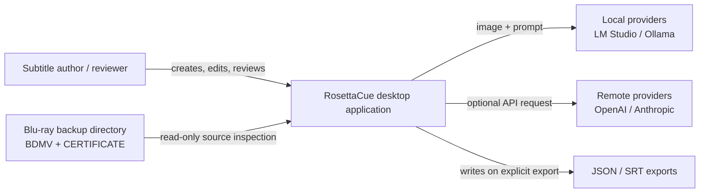

### 2.2 Primary user journey

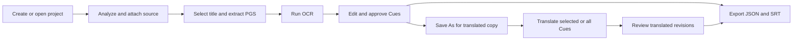

The source and translated projects are deliberately not modeled as parallel text columns. Translation is a revision-producing operation on the active project. A user who wants to preserve both languages creates a project clone with **Save As** and translates the clone.

### 2.3 Design principles

1. **Canonical structured data first.** JSON preserves information that SRT cannot represent.
2. **Immutable machine evidence.** OCR attempts and recognition output remain available after human edits.
3. **Append-first authoring history.** Editing, restoration, translation, undo, and redo append revisions. Explicit user-confirmed history deletion is the sole exception and cannot remove a Cue's final revision.
4. **Explicit human save.** Inspector changes remain renderer-local until **Save Cue** or a project save command invokes persistence.
5. **Local-first ownership.** Project state and Cue assets live inside the user-selected package.
6. **Transport independence.** Electron is an adapter; business behavior remains in Rust.
7. **Least privilege.** The renderer has neither Node.js nor filesystem access.
8. **Cue-boundary interruption.** Long OCR work pauses and stops only after a safe Cue transaction boundary.
9. **Provider interchangeability.** Main-text OCR, optional separate ruby recognition, style validation, and translation choose provider profiles independently.
10. **One theme system.** shadcn semantic tokens drive both light and dark appearances.

## 3. Logical architecture

### 3.1 Runtime topology

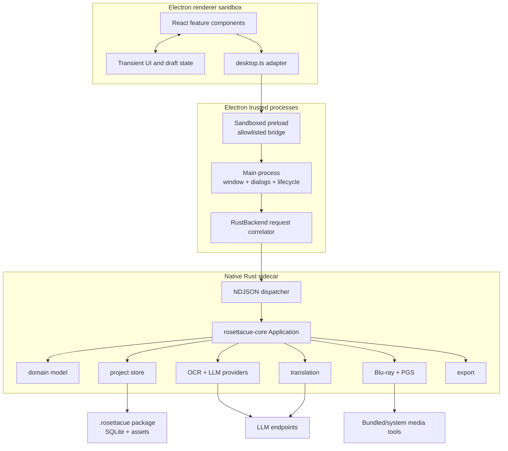

### 3.2 Responsibility allocation

| Layer                | Owns                                                                           | Must not own                                      |
| -------------------- | ------------------------------------------------------------------------------ | ------------------------------------------------- |
| React renderer       | Layout, dialogs, selection, filters, unsaved Cue drafts, progress presentation | Filesystem, SQLite, provider HTTP, process launch |
| Preload              | Narrow `invoke`, event subscription, native dialog, window-mode facade         | Raw `ipcRenderer`, arbitrary channels             |
| Electron main        | Native window, dialog, external-link policy, sidecar lifecycle                 | Subtitle business rules, project SQL              |
| Rust backend adapter | NDJSON parsing, typed command decoding, progress emission, OCR controller      | Visual state, native window behavior              |
| Core application     | Use-case orchestration and domain validation                                   | Electron or React dependencies                    |
| Project crate        | Package layout, schema validation, SQLite transactions, path confinement       | Network calls, desktop UI                         |
| Media crates         | Source inspection, demux, SUP decode, PNG generation                           | Project workflow policy                           |
| LLM/OCR crates       | Provider protocol, prompting, validation, normalization                        | API-key persistence, project UI                   |
| Translation crate    | Structured subtitle translation                                                | Project copy policy                               |
| Export crate         | Canonical document assembly and JSON/SRT writing                               | Dialog and destination selection                  |

### 3.3 Rust crate dependency view

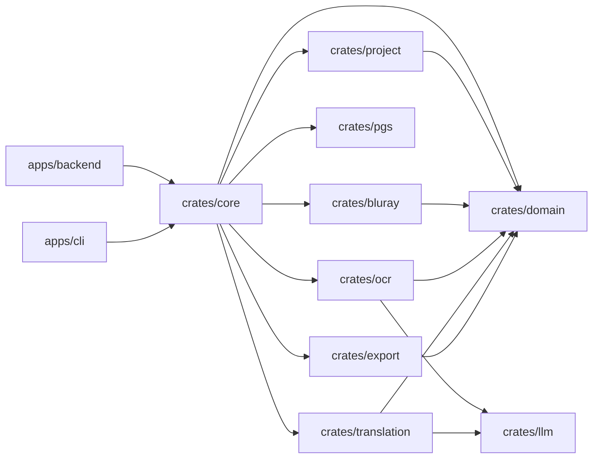

The CLI and Electron sidecar are sibling adapters over the same `Application` API. Neither adapter may bypass the core to manipulate project records.

## 4. Desktop runtime specification

### 4.1 Window modes

RosettaCue uses one `BrowserWindow` with two modes.

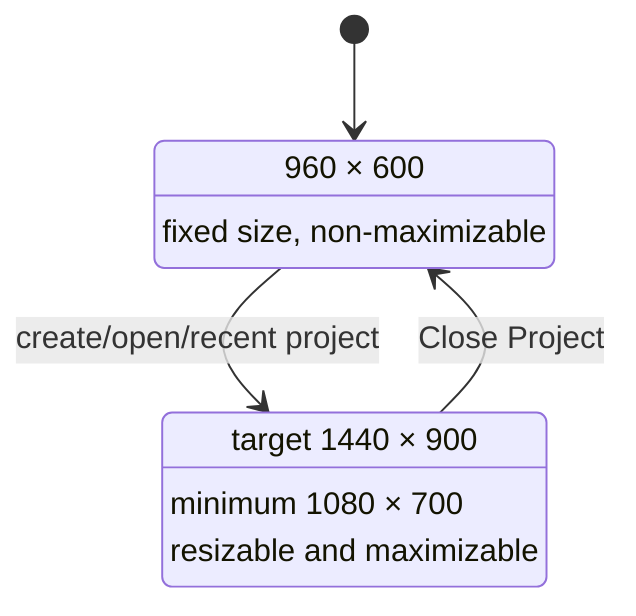

On macOS, `hiddenInset` retains native traffic lights. Their configured position aligns the native controls with the 56 px application title bar and the 32 px product mark. The renderer marks the title bar as draggable and explicitly marks buttons as non-draggable.

### 4.2 BrowserWindow security properties

- `contextIsolation: true`
- `nodeIntegration: false`
- `sandbox: true`
- `webSecurity: true`
- HTTP(S) child windows denied and delegated to the operating system.
- Renderer navigation away from the application URL denied.
- Preload exposes only an immutable, purpose-specific API object.
- Main and preload each validate method/event names against static allowlists.

### 4.3 Sidecar lifecycle

Development executable:

```text
target/debug/rosettacue-backend[.exe]
```

Packaged executable:

```text
resources/backend/rosettacue-backend[.exe]
```

Electron starts the backend without a shell, gives it an application-data working directory, and passes the packaged media-tool directory through `ROSETTACUE_MEDIA_TOOLS_DIR`. Pending renderer promises are rejected if the process exits. Electron terminates the sidecar when the application quits.

## 5. IPC and sidecar protocol

### 5.1 Transport framing

The Electron main process and Rust sidecar exchange UTF-8 NDJSON over standard input/output. Standard output is protocol-only. Diagnostics go to standard error.

Request:

```json
{
  "id": "a1",
  "method": "project_document",
  "params": { "path": "/Projects/Belle.rosettacue" }
}
```

Success:

```json
{
  "id": "a1",
  "result": { "project": {}, "sources": [], "tracks": [], "cues": [] }
}
```

Failure:

```json
{
  "id": "a1",
  "error": { "code": "backend_error", "message": "not a RosettaCue project" }
}
```

Event:

```json
{
  "event": "ocr-progress",
  "payload": {
    "phase": "cue-complete",
    "current": 8,
    "total": 1644,
    "cue_index": 8
  }
}
```

Request IDs permit concurrent out-of-order completion. A single Rust writer thread serializes every response and event, preventing byte interleaving.

### 5.2 Command catalog

| Method                    | Principal parameters                                      | Result                      | Mutation                     |
| ------------------------- | --------------------------------------------------------- | --------------------------- | ---------------------------- |
| `backend_info`            | none                                                      | backend name/version/schema | No                           |
| `media_tool_diagnostics`  | none                                                      | tool availability list      | No                           |
| `create_project`          | parent, name                                              | `ProjectOverview`           | Creates package              |
| `save_project_as`         | projectPath, parent, name                                 | cloned `ProjectOverview`    | Creates package              |
| `open_project`            | path                                                      | `ProjectOverview`           | No                           |
| `project_document`        | path                                                      | complete editor document    | No                           |
| `update_project_settings` | projectPath, project settings                             | `ProjectOverview`           | Yes                          |
| `export_subtitles`        | projectPath, `ExportOptions`                              | artifacts                   | Writes exports and audit row |
| `inspect_bluray_source`   | path                                                      | `BlurayDiscInfo`            | No project mutation          |
| `attach_bluray_source`    | projectPath, sourcePath                                   | source + overview           | Yes                          |
| `extract_pgs_track`       | projectPath, sourceId, titleIndex, streamIndex            | track + Cue count           | Yes                          |
| `cue_image`               | projectPath, imagePath                                    | PNG bytes                   | No                           |
| `save_cue_edit`           | projectPath, cueId, edit document                         | revision                    | Yes                          |
| `restore_cue_edit`        | projectPath, cueId                                        | human revision from OCR     | Yes                          |
| `cue_revision_history`    | projectPath, cueId                                        | revisions newest first      | No                           |
| `restore_cue_revision`    | projectPath, cueId, revisionId                            | appended revision           | Yes                          |
| `delete_cue_revision`     | projectPath, cueId, revisionId                            | remaining revisions         | Yes                          |
| `review_cue`              | projectPath, cueId, status, note                          | decision + overview         | Yes                          |
| `provider_models`         | provider, baseUrl, apiKey                                 | model IDs                   | Provider read                |
| `diagnose_provider`       | provider, baseUrl, apiKey                                 | reachability/latency/models | Provider read                |
| `recognize_ocr`           | projectPath, Cue IDs, language, overwrite, pipeline       | job result                  | Yes                          |
| `translate_cues`          | projectPath, Cue IDs, target language, overwrite, profile | job result                  | Yes                          |
| `project_jobs`            | projectPath                                               | durable job list            | Recovery normalization       |
| `cancel_project_job`      | projectPath, jobId                                        | job                         | Yes                          |
| `configure_diagnostics`   | enabled                                                   | none                        | App preference               |
| `resume_ocr_job`          | projectPath, jobId, pipeline                              | job result                  | Yes                          |
| `resume_translation_job`  | projectPath, jobId, profile                               | job result                  | Yes                          |
| `pause_ocr`               | none                                                      | unit                        | In-memory controller         |
| `resume_ocr`              | none                                                      | unit                        | In-memory controller         |
| `stop_ocr`                | none                                                      | unit                        | In-memory controller         |

### 5.3 Event catalog

| Event                     | Purpose                                               | Key fields                                                   |
| ------------------------- | ----------------------------------------------------- | ------------------------------------------------------------ |
| `pgs-extraction-progress` | Demux/decode progress and incremental Cue publication | phase, current, estimated_total, cue                         |
| `ocr-progress`            | Cue-level OCR status and recognition publication      | phase, current, total, cue_id, cue_index, recognition, error |
| `ocr-control-state`       | Confirms a worker reached paused state                | state string                                                 |
| `translation-progress`    | Cue-level translated revision publication             | phase, current, total, cue_id, revision, error               |

## 6. Project package and persistence

### 6.1 Package layout

```text
Movie.rosettacue/
├── project.sqlite
└── assets/
    ├── cues/
    │   └── <track-uuid>/
    │       ├── 000001.png
    │       └── ...
    ├── tracks/
    │   └── <track-uuid>/source.sup
    ├── thumbnails/
    └── proxy/
```

The `.rosettacue` suffix denotes a directory package, not a single archive. `project.sqlite` is authoritative for metadata and relationships. Binary Cue images and demuxed tracks are addressed through project-relative paths.

### 6.2 Entity relationship diagram

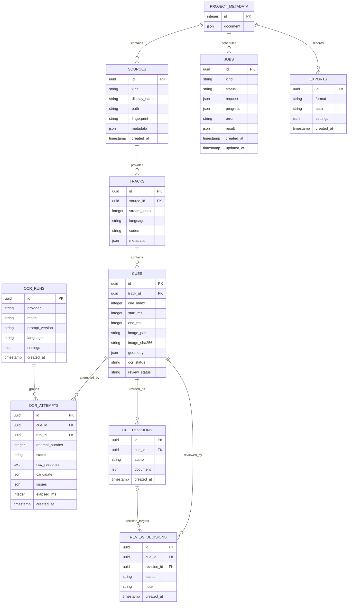

### 6.3 Table semantics

#### `project_metadata`

Exactly one row (`id = 1`) stores `ProjectMetadata` as JSON. Metadata contains schema version, project UUID, name, timestamps, optional clone origin, and project-scoped OCR language, translation target, and proper-noun mappings. The settings field has deterministic defaults when reading a schema-1 package created before the field existed; saving settings writes it only to the active project package.

#### `sources`

One row per attached Blu-ray directory. `(kind, path)` is unique. `metadata` contains the analyzed disc titles and main-title selection.

#### `tracks`

One row per extracted PGS stream. `metadata` includes source title index, playlist, and project-relative SUP path.

#### `cues`

One row per decoded image subtitle. `(track_id, cue_index)` is unique. Timing and geometry originate from PGS. `ocr_status` and `review_status` are denormalized current-state fields used for filtering and statistics.

#### `ocr_runs` and `ocr_attempts`

Runs store redacted provider configuration and prompt identity. Attempts retain raw response, parsed candidate, issues, elapsed time, and outcome. API keys are not stored.

#### `cue_revisions`

Append-only effective documents authored by `ocr`, `human`, or `translation`. Saving or restoring does not update an earlier row.

#### `review_decisions`

Append-only human decisions. Each decision points to the latest revision at decision time. A later revision invalidates the Cue's current approval by resetting `review_status` to `unreviewed`.

#### `jobs`

Durable OCR, translation, and extraction job metadata includes serialized `request` and optional `result`, allowing interrupted jobs to be reconstructed without UI memory.

#### `exports`

Audit records for successfully written artifacts. The subtitle file itself is external to the package unless the user selects a package subdirectory.

### 6.4 Referential and uniqueness rules

- Deleting a source cascades to tracks, Cues, attempts, revisions, and decisions through the track/Cue graph.
- Deleting a revision sets `review_decisions.revision_id` to null, preserving the historical decision.
- A source path cannot be attached twice for the same source kind.
- A PGS track cannot be extracted twice for the same source, title, and stream.
- A Cue index is unique within its track.
- An OCR attempt number is unique within one Cue/run pair.

### 6.5 Exact schema contract

The current project schema version is **1**. Opening a package requires `PRAGMA user_version = 1`; every other value is rejected with `UnsupportedSchema`. RosettaCue ships no SQLite schema migration code and accepts exactly one table representation. The additive `ProjectMetadata.settings` object defaults when absent so earlier schema-1 packages remain readable without rewriting their database. This is intentional while the project format stabilizes.

## 7. Canonical subtitle model

### 7.1 Cue edit document

```json
{
  "start_ms": 67,
  "end_ms": 2611,
  "position": "bottom-center",
  "subtitle": {
    "prompt_version": "subtitle-ocr-v5",
    "provider": "lmstudio",
    "model": "gemma-4-31b-it",
    "language": "jpn",
    "unreadable": false,
    "lines": [],
    "normalizations": []
  }
}
```

### 7.2 Text, ruby, and styles

```json
{
  "text": "Uは この世の知性を司る",
  "spans": [
    {
      "type": "text",
      "text": "Uは ",
      "styles": ["italic"],
      "color": "#FF0000"
    },
    {
      "type": "text",
      "text": "この世の知性を",
      "styles": []
    },
    {
      "type": "ruby",
      "base": "司",
      "annotations": [{ "text": "つかさど", "position": "over" }],
      "styles": ["bold", "italic"]
    },
    {
      "type": "text",
      "text": "る",
      "styles": ["underline"]
    }
  ]
}
```

Ruby is named after the typographic ruby annotation convention. `base` is the exact character range receiving the annotation. `annotations[].text` is displayed above (`over`) or below (`under`) that range. This representation can express both Japanese furigana and non-language-specific interlinear annotation without embedding custom XML into plain text.

Every text and ruby span has a required `styles` array. The allowed values are `bold`, `italic`, `underline`, `strikethrough`, `superscript`, and `subscript`; an unstyled span uses an empty array. A span may also contain an optional uppercase `#RRGGBB` `color`. Missing color means the default white subtitle foreground, so white is never stored as an explicit color. No line-level style summary exists. Adjacent runs may have different styles and colors, enabling human reviewers to format selected ranges. A ruby span applies one style array and color to its complete base range. Style values are unique and canonicalized in a fixed order. `superscript` and `subscript` are mutually exclusive on the same span.

Span normalization runs after every editor mutation and again at the Save Cue boundary. Adjacent ordinary text spans with the same canonical style array and color are maximally coalesced into one span. Ruby spans are semantic boundaries and never merge with surrounding text or another ruby span, even when their formats match. This rule makes a format toggle reversible: applying bold or color to a substring may temporarily split one run into three, but removing it joins compatible text runs back into one canonical span.

The OCR style phase makes conservative decisions for the complete Cue. It returns italic only when every large main-subtitle row and glyph is consistently italic. PGS supplies composed palette-indexed bitmaps, geometry, timing, and palette data, but no font family or semantic italic flag. Italic therefore cannot be recovered deterministically from PGS alone; pixel slant or glyph-shape analysis remains a heuristic unless an external font/template identity is known. It returns a named non-white color only when the main glyph interiors are clearly and uniformly that color; white, near-white, mixed, outlined, shadowed, and ambiguous cases use the default. The deterministic assembler applies the accepted format to every generated span. OCR never guesses substring formats. Fine-grained styles and colors are authored in the Inspector editor during human review.

### 7.3 Position and geometry

The nine allowed subtitle positions are:

```text
top-left       top-center       top-right
middle-left    middle-center    middle-right
bottom-left    bottom-center    bottom-right
```

PGS geometry stores exact canvas and bitmap coordinates. The semantic position is derived by dividing the Cue center into a deterministic 3×3 canvas grid. A human revision may override the semantic position without rewriting original PGS geometry.

### 7.4 Canonical-versus-derived rule

JSON export retains:

- Cue identity and index;
- timing;
- nine-grid position;
- geometry and forced/inferred flags;
- review status;
- image hash;
- per-span bold, italic, underline, strikethrough, superscript, and subscript styles plus optional font color;
- ruby spans;
- OCR provenance and normalization records.

SRT retains sequence and timing, writes commonly supported inline `<b>`, `<i>`, and `<u>` markup, flattens ruby to its base text, and omits strikethrough, superscript, subscript, and font color with export warnings. RosettaCue does not emit SRT color markup. Position, geometry, ruby placement, font information, unsupported formats, provenance, and review history remain available in the project and JSON. This policy reflects SRT's limited, player-dependent HTML-derived formatting and absence of portable placement or ruby semantics ([Library of Congress format description](https://www.loc.gov/preservation/digital/formats/fdd/fdd000569.shtml), [Matroska subtitle notes](https://www.matroska.org/technical/subtitles.html)). Future ASS export may map the richer style set and placement. WebVTT is a separate candidate when standardized ruby cue spans are needed ([W3C WebVTT](https://www.w3.org/TR/2026/CRD-webvtt1-20260520/)). Ruby remains canonical project data even where the target format needs layout-based emulation.

## 8. Detailed workflows

### 8.1 Create and open project

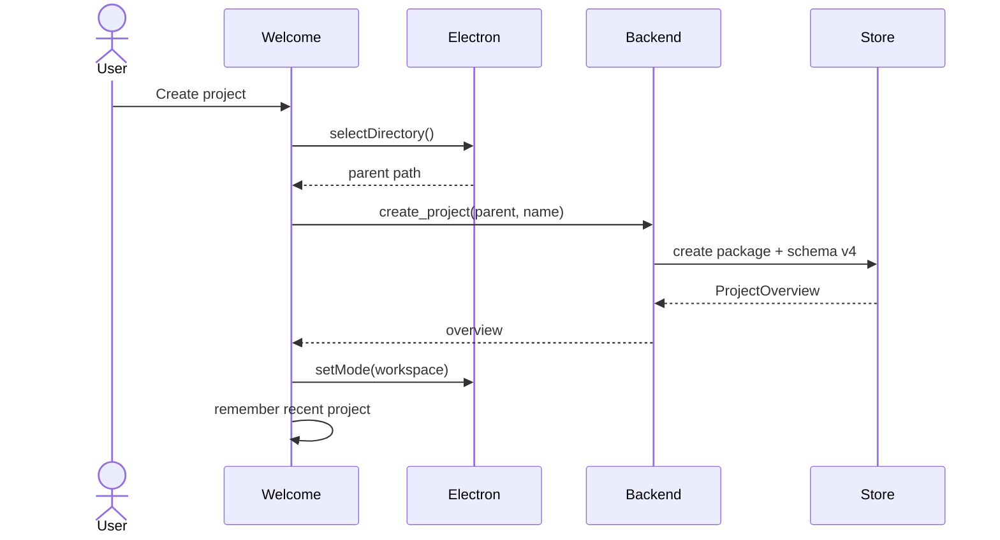

Open validates that `project.sqlite` exists and that its schema version is exactly 1. Recent projects are a renderer preference and do not replace package validation.

### 8.2 Save As

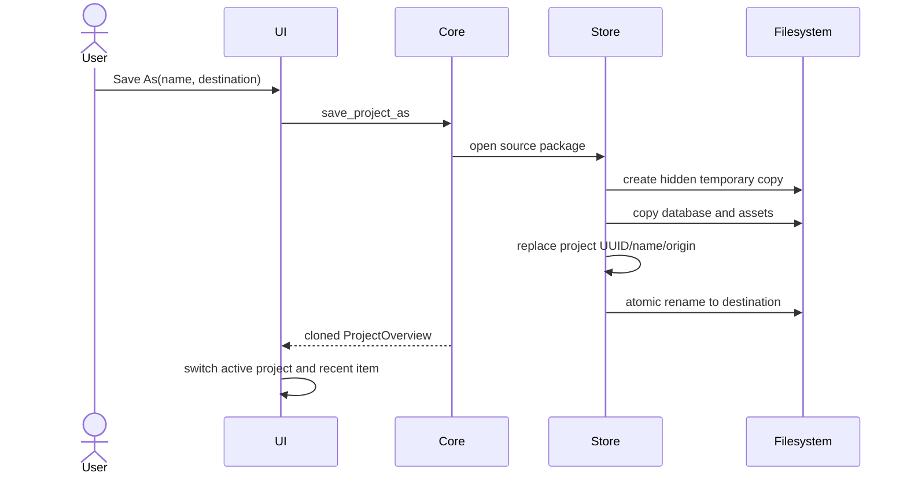

The destination must not exist or be inside the source package. A failed copy removes its temporary directory when possible.

### 8.3 Source analysis and attachment

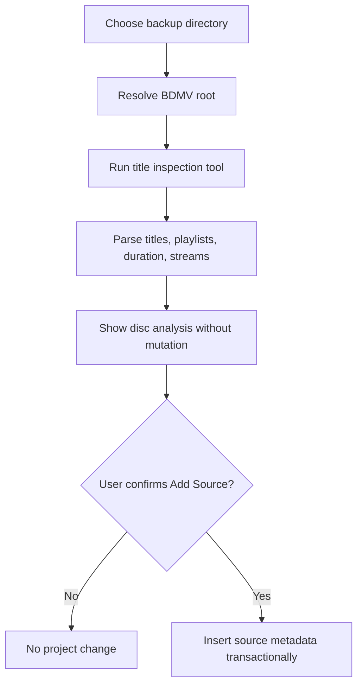

Inspection is read-only. Attachment repeats or trusts the same validated analysis in the core and rejects duplicate source paths.

### 8.4 PGS extraction

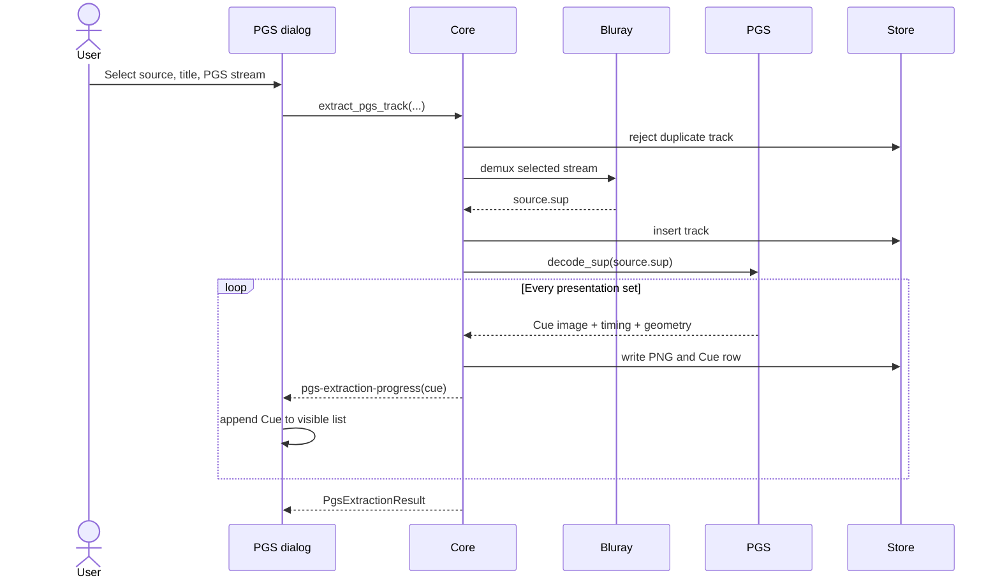

The UI can begin Cue review as soon as Cue events arrive; extraction completion is not required before the list becomes useful.

### 8.5 OCR pipeline

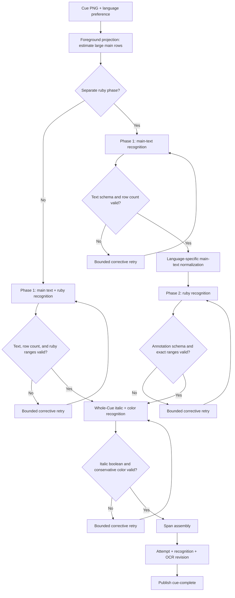

Recognition, optional ruby, and validation profiles may use different providers and models. With `ruby: null`, Phase 1 uses `recognition` for main characters and ruby/furigana in one image request, followed by style recognition. With a Ruby provider present, Phase 1 recognizes only large main text, the normalized main lines are supplied to the Ruby provider for Phase 2, and style recognition becomes Phase 3. The Ruby response contains annotations only and must reference an exact base substring in the supplied normalized lines. All OCR profiles require vision-capable models. Provider configuration is validated before the job begins; the Ruby profile is required only in separate mode. Translation is a separate text-only operation after OCR.

Before the first provider request, the OCR crate decodes the PNG and projects foreground pixels onto the vertical axis. Contiguous row clusters near the maximum glyph-row height are counted as likely large main rows; shorter clusters are treated as ruby candidates. When the estimate is reliable, the stage responsible for main-text recognition must return exactly that many main lines. A mismatch is rejected and retried, preventing a syntactically valid one-line response from silently dropping a second visible row. The estimate recognizes layout only and never substitutes for character OCR.

For Japanese, normalization records every change and applies language-specific
punctuation and character rules. The canonical long-vowel mark is `ー`;
punctuation normalization uses Japanese full-width conventions, and ellipsis
policy is deterministic. Model-provided control characters are preserved without
model-specific substitution, while halfwidth-to-fullwidth symbol normalization
remains active.

OCR language presets are defined inside the OCR crate for English (`eng`), French
(`fra`), German (`deu`), Italian (`ita`), Japanese (`jpn`), Korean (`kor`), and
Spanish (`spa`). Each preset owns its prompt guidance and normalization policy.
The five Latin-script presets share one literal-recognition policy that preserves
case, diacritics, punctuation, and spacing without language correction; only
their canonical language identity differs.

### 8.6 OCR control and checkpointing

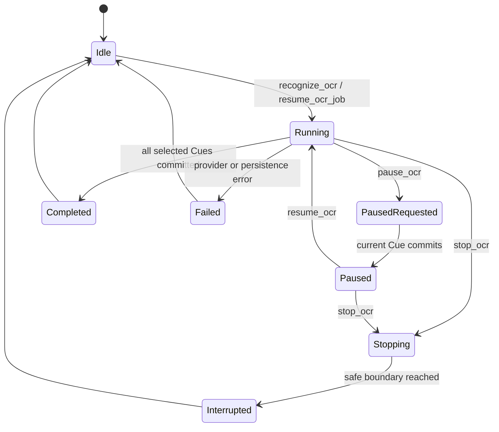

Pause and stop are cooperative. The active Cue is never abandoned mid-transaction. After each successful Cue, `jobs.progress.completed_cue_ids` is updated. Application restart converts stale `running` or `paused` jobs to `interrupted`, allowing explicit resume with the current model configuration.

### 8.7 Human edit and review

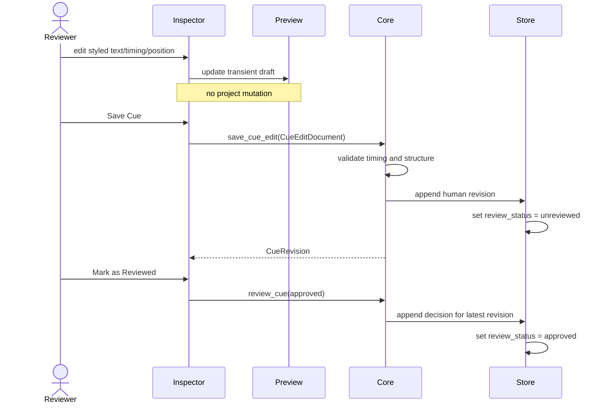

Undo restores the preceding historical revision by appending a new human revision. Redo uses a renderer session stack containing the revision ID that Undo replaced. Neither operation deletes history.

### 8.8 Translation

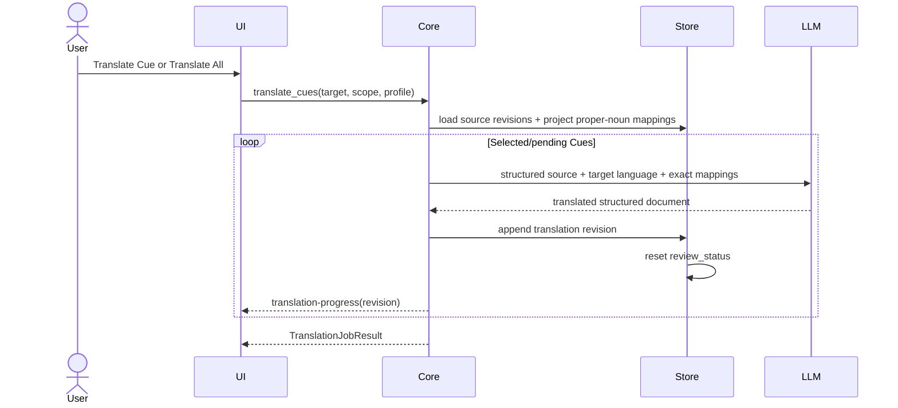

The original project is not automatically duplicated. The recommended bilingual workflow is **Save As**, then translate the clone. Translation preserves timing and semantic position while producing a new subtitle document.

### 8.9 Export

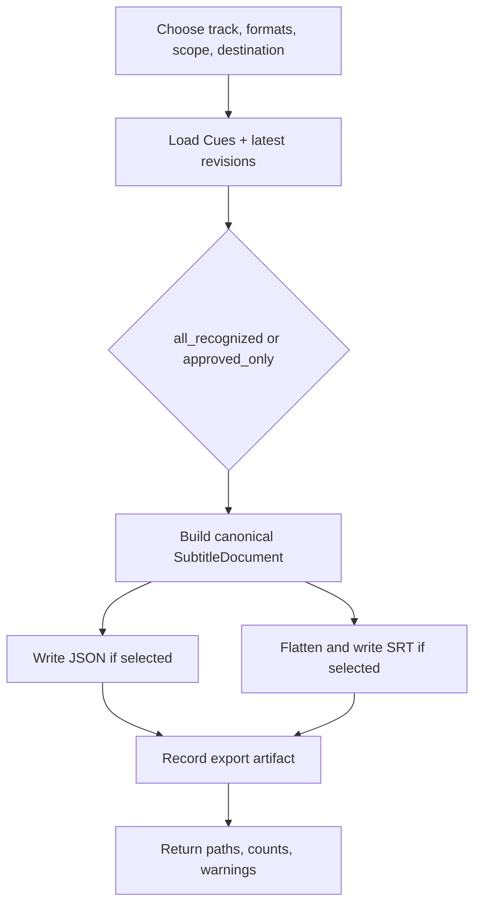

Multiple-track projects require an explicit track ID. Export rejects an empty format set or a scope with no eligible Cues.

## 9. UML design

### 9.1 Core class diagram

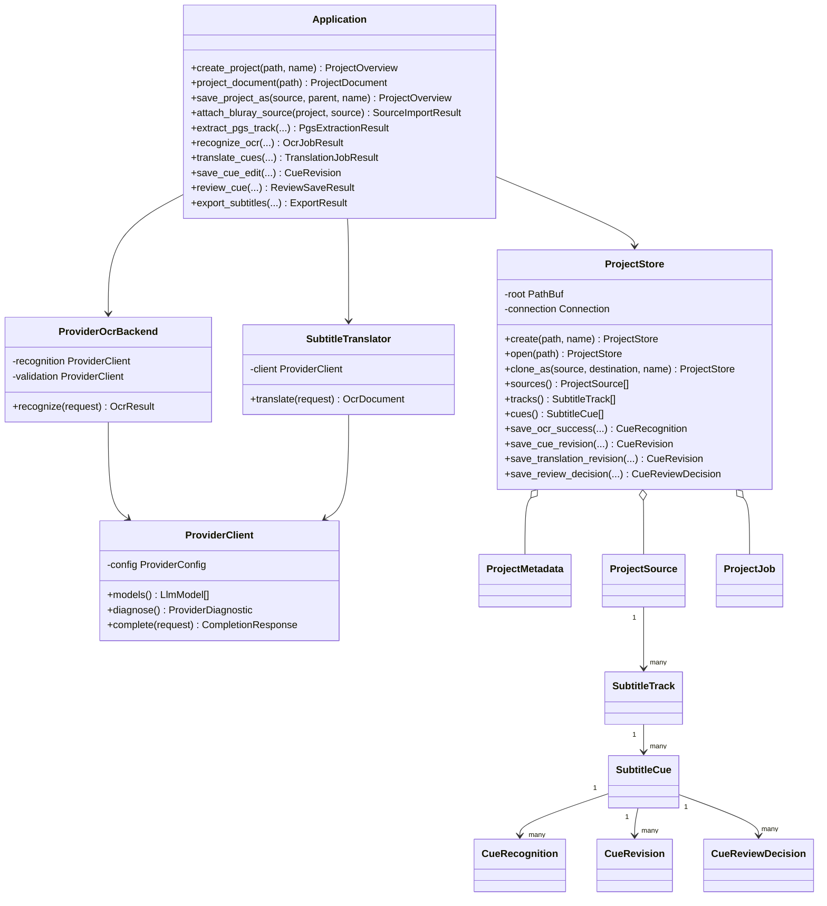

### 9.2 Desktop adapter class diagram

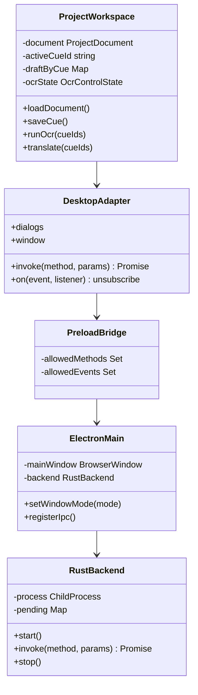

## 10. User interface specification

### 10.1 Welcome window

The Welcome window follows native document-application conventions rather than a web landing page.

- Left pane: brand, version, Create, and Open.
- Right pane: recent project list or empty state.
- Fixed compact window.
- No redundant website navigation or dashboard cards.
- Recent path selection always revalidates through `open_project`.

### 10.2 Workspace hierarchy

```text
Native title bar
└── traffic lights / reserved gap / product mark / project name and path
Ribbon tabs
├── Project: Save, Save As, Import Source, Export
├── Edit: Undo, Redo
├── Subtitle: Extract PGS, Start Full OCR, Pause, Resume, Stop
├── Review: Mark Reviewed, Refresh Cues
└── Translate: Translate Cue, Translate All
Ribbon status region
├── Cue count
├── source count
├── OCR-complete count
├── reviewed count
└── Settings
Resizable editing surface
├── Cue List
└── Main editing column
    ├── Original Cue / Subtitle Preview
    └── Inspector
Status bar
└── operation state and progress
```

Ribbon statistics are right aligned. Their numbers use stronger weight, larger size, and tabular figures. Full-height separators divide commands, statistics, and Settings. Cue count appears only in the ribbon status group and Cue List header, not as a title-bar badge.

Ribbon tabs own only the ribbon command panel. Home gathers the high-frequency save, undo/redo, single-Cue OCR/translation, Review & Next, and revision-history actions. Cue List, Preview, and Inspector are a single persistent editing surface outside the tab panels. Cue List width and the Preview/Inspector vertical split are independently resizable. The comparison switches from two columns to two rows when its panel is narrow, preventing intrinsic-width overflow. Inspector has a content-oriented maximum height and scrolls internally below its minimum usable height. Switching tabs must not remount `CueComparison`, reload the Cue bitmap, discard an object URL, change Cue selection, or reset an Inspector draft.

### 10.3 Cue List

- Search accepts Cue number or recognized/effective text.
- Each row shows padded Cue index, start time, and latest effective text.
- Latest revision wins; recognition is the fallback.
- Pending or failed-to-recognize rows use subdued text, recognized/unreviewed rows use the normal treatment, and approved rows use a subtle semantic-success background.
- Rows may appear incrementally during extraction.
- Selection drives preview and Inspector without mutating the project.

### 10.4 Preview

The center panel renders source and generated subtitle side by side when wide, and stacks them when the resized panel becomes narrow. Both halves use the same `canvas_width × canvas_height` SVG view box, identical content padding, and the same aspect-ratio policy. The original image is read through the confined `cue_image` command and projected using the Cue's bitmap dimensions plus extraction padding. The generated subtitle is rendered through an SVG `foreignObject` at the unpadded Cue geometry; font size and line height are derived from that geometry. When the semantic position is unchanged, the source bounding box is preserved exactly. An edited nine-grid position moves the same-sized generated box to the requested anchor. This keeps position and apparent scale directly comparable instead of independently sizing the two panes. Ruby spans render through HTML ruby markup; `ruby-position` is applied to the ruby container so `over` and `under` remain visually distinct in Chromium. Bold, italic, underline, strikethrough, superscript, subscript, and font color render independently for each span.

The native close control is the only project-window close affordance. Theme changes are made through Settings. The status bar does not label projects as local because all RosettaCue projects are local by definition.

### 10.5 Inspector

Inspector is the resizable lower panel beneath Cue Comparison. It is the only timing-editing surface. Inspector responsibilities:

- selected Cue identity and current statuses;
- single-Cue OCR with overwrite semantics;
- single-Cue translation;
- explicit human review approval with a Reviewed-button toggle back to unreviewed;
- review-and-next navigation plus adjacent-Cue controls beside the review action;
- visible OCR status beside the Inspector title rather than inside timing controls;
- Cue revision-history viewing, a visible revision count beside its icon, restoration, and guarded deletion that retains at least one revision;
- WYSIWYG text editing with selection-based bold, italic, underline, strikethrough, superscript, subscript, and font-color controls;
- selection-based ruby creation, editing, removal, and over/under placement within one subtitle line;
- preservation of ruby spans while editing surrounding styled ranges;
- start/end timestamp editing;
- direct nine-grid position editing through an accessible 3×3 button grid;
- explicit **Save Cue** action.

The Save button is disabled until the draft differs from the latest effective revision. Timestamps use `HH:MM:SS.mmm`; End must be later than Start.

### 10.6 Settings

Settings uses a left-section layout:

- **General:** theme and media-tool diagnostics.
- **Project:** OCR language, translation target language, and exact source-to-translation proper-noun mappings. These values persist in `ProjectMetadata` and never apply to an unrelated project.
- **Models:** independent Text OCR, optional separate Ruby, Style, and post-OCR Translation profiles. A switch selects the two-request combined pipeline or the three-request separated pipeline and shows the corresponding phase numbers and cost/latency note.
- **Advanced:** application-wide debug logging and the independent Debug Log window.

Supported providers are LM Studio, Ollama, OpenAI API, and Anthropic API. A profile contains the common fields — base URL, model, optional session API key, timeout, token limit, attempt count — plus a provider spec: the provider selection together with the parameters only that provider accepts, currently reasoning effort on OpenAI. A parameter lives on its provider's branch of the spec, so a profile carrying another provider's parameter is unrepresentable rather than validated away. In profile JSON the common fields stay flat and the provider-specific parameters nest under a `provider_options` block; the CLI accepts the same document shape through `--config`, with `api_key_env` naming an environment variable in place of a literal key, since a config document lives on disk. API keys remain only in renderer memory and are redacted from local preferences and project records.

OpenAI reasoning models take the output cap as `max_completion_tokens` and reject the sampling parameters local OpenAI-compatible servers rely on for determinism, so the two dialects build different request bodies. Reasoning tokens are billed at the output rate and the server-side default is not `none`, so every OpenAI profile defaults to `reasoning_effort: none`: recognition, style, and translation are transcription tasks that gain no accuracy from deliberation.

Recognition, ruby, style, and translation prompts are each split into a stable half — task and language guidance plus the response schema, byte-identical for every Cue at that stage — and a per-Cue half carrying the deterministic row estimate or the already-recognized main lines. Anthropic requests place a cache breakpoint at the end of the stable half; OpenAI requests fold it into the system turn so automatic prefix caching can match it. Providers that do not cache are unaffected, because the two halves are concatenated in order.

### 10.7 Theme and component system

The renderer uses shadcn preset `b27GcrRo`:

| Property          | Value          |
| ----------------- | -------------- |
| Style             | base-rhea      |
| Primitive library | Base UI        |
| Base color        | neutral        |
| Icon library      | Lucide         |
| Font              | Inter Variable |
| CSS framework     | Tailwind CSS 4 |

Application styling uses semantic tokens such as `background`, `foreground`, `muted`, `card`, and `border`. Component code does not maintain separate hard-coded light and dark palettes.

### 10.8 Localization boundary

Domain enums and persisted language values use stable codes such as `jpn`, `kor`, and `eng`. Presentation labels are not persisted in project data. Paraglide JS owns presentation messages, with English as the base and only configured locale. Source messages live in `messages/en.json` and compile into the generated `src/paraglide/` runtime. Localization operates exclusively at the renderer and native desktop presentation boundary and does not alter IPC method names, enum wire values, provider identifiers, or project JSON.

## 11. Concurrency, transactions, and state

### 11.1 Concurrency model

- Electron may issue concurrent sidecar requests.
- Rust dispatches each parsed request on a worker thread.
- A single writer thread serializes outgoing protocol messages.
- SQLite transactions protect multi-row state changes.
- One OCR controller permits only one active OCR job per sidecar process.
- Translation and extraction publish progress independently through callback events.

### 11.2 Transaction boundaries

| Operation       | Atomic boundary                                           |
| --------------- | --------------------------------------------------------- |
| OCR Cue success | attempt + revision + recognition status update            |
| OCR Cue failure | failure attempt + Cue status + job failure                |
| Human save      | revision insert + approval invalidation                   |
| Review          | decision insert + Cue review status update                |
| Save As         | copy to hidden temp + metadata replacement + final rename |
| Cue extraction  | each PNG/Cue persistence step; final track result         |
| Export audit    | artifact write first, audit record after success          |

### 11.3 Effective Cue resolution

```text
latest Cue revision
  else latest recognition
  else no subtitle document
```

Within revisions, the newest append is effective regardless of author. Translation source selection is different: it deliberately chooses the latest non-translation revision to avoid repeatedly translating an already translated result.

### 11.4 Review invalidation

Any new OCR, human, restored, or translation revision changes the evidence being reviewed. The Cue returns to `unreviewed`. Approval applies only to the revision referenced by its review decision. A user may also append an explicit `unreviewed` decision by toggling the Reviewed Inspector action.

## 12. Failure handling and recovery

### 12.1 Error propagation

Rust errors cross the protocol as stable `backend_error` envelopes with human-readable messages. Electron rejects the matching pending promise. Renderer feature code displays the error near the responsible dialog or in the Workspace alert/status bar.

### 12.2 Interrupted work

At project open/job listing, stale `running` and `paused` job states become `interrupted`. The completed Cue ID checkpoint remains durable. Resume creates or advances work only for remaining Cues, using a freshly supplied redacted-capable provider profile.

### 12.3 Safe Ctrl+C and application quit

The CLI/backend process can be interrupted without corrupting already committed Cues. A Cue currently inside a provider request may not have a committed success record, but prior Cue transactions remain valid. On a normal Electron quit, the main process terminates the sidecar after rejecting pending renderer requests.

### 12.4 Path confinement

Cue image reads resolve project-relative paths and reject traversal outside the package. Save As rejects destinations inside the source. Export writes only to a directory explicitly selected by the user.

## 13. Provider and privacy specification

### 13.1 Provider abstraction

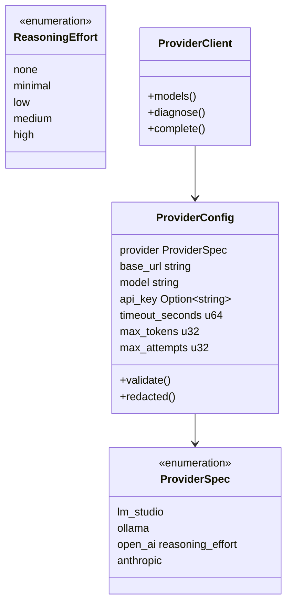

LM Studio, Ollama, and OpenAI use an OpenAI-compatible request shape where applicable. Anthropic uses its provider-specific message payload. The abstraction normalizes model listing, completion, response text, and usage metadata.

### 13.2 Data disclosure

- Local providers receive Cue images and prompts over loopback or the configured local endpoint.
- Remote providers receive Cue image content and subtitle context over the network only when explicitly selected as a task profile.
- API keys are not stored in `.rosettacue`, OCR run settings, localStorage, logs, or exports.
- Raw model response may be stored in OCR attempts for verification; it belongs to the local project package.
- RosettaCue performs no implicit telemetry or project upload in this design.

### 13.3 Log hygiene

Protocol standard output must never contain free-form logging. Provider configuration is redacted before durable persistence. Error messages must not concatenate API keys or authorization headers.

When the user explicitly enables debug logging, structured entries cover
Electron IPC, Rust RPC dispatch, media subprocesses, PGS decoding, project
transactions, user data mutations, OCR/translation stages, exports, and LLM
HTTP exchanges. Electron stores them as rotating session JSONL files outside
project packages and exposes them through a separate resizable viewer.

Provider diagnostics preserve the complete response body before normalized
content extraction, together with HTTP status and safe headers. API keys,
authorization headers, cookies, base64 images, and binary payloads remain
redacted. Because project text, file paths, prompts, and provider responses may
be present, the UI warns that debug logging can expose local project data,
increase disk use, and reduce performance.

## 14. Export specification

### 14.1 Export options

```json
{
  "track_id": "uuid",
  "formats": ["json", "srt"],
  "scope": "all_recognized",
  "output_directory": "/Users/name/Subtitles",
  "base_name": "Belle.jpn"
}
```

### 14.2 SRT derivation

For every eligible Cue, SRT generation:

1. selects the latest effective revision;
2. emits sequential numbering;
3. formats `start_ms` and `end_ms` as SRT timestamps;
4. joins line plain text with newline;
5. preserves only `<b>`, `<i>`, and `<u>` portable inline markup;
6. flattens ruby to base text and omits strikethrough, superscript, and subscript;
7. records explicit warnings when ruby or an unsupported span style is flattened; placement loss is part of the documented SRT format policy rather than a per-Cue warning.

### 14.3 JSON stability

The JSON subtitle document has its own format/version marker independent of the project SQLite schema. Consumers must use the JSON format version rather than assume project schema equivalence.

## 15. Packaging and platform specification

### 15.1 Package contents

electron-builder packages:

- Vite renderer assets;
- compiled Electron main and preload bundles;
- platform/architecture Rust sidecar;
- platform application icons;
- staged media tools under `resources/tools`.

### 15.2 Targets

| Platform | Targets       | Backend name             |
| -------- | ------------- | ------------------------ |
| macOS    | DMG, ZIP      | `rosettacue-backend`     |
| Windows  | NSIS          | `rosettacue-backend.exe` |
| Linux    | AppImage, DEB | `rosettacue-backend`     |

Native Rust and bundled media executables make release artifacts architecture-specific. Platform media-tool licenses and notices must accompany public builds.

### 15.3 Development and release separation

Development resolves the debug sidecar and loads Vite. Packaged builds load `dist/index.html` from `app.asar` and resolve the release sidecar from Electron resources. Visual QA must not run development and packaged applications simultaneously because both may share the product name and bundle identifier.

## 16. Quality and verification

### 16.1 Automated verification

```text
pnpm typecheck  -> TypeScript contract and component checking
pnpm lint       -> renderer/Electron static analysis
pnpm test       -> Vitest + complete Rust workspace tests
pnpm build      -> release Rust + renderer/main/preload compilation
pnpm package    -> platform application artifact construction
```

Rust tests cover domain classification, PGS parsing/decoding, exact project-schema validation and transactions, OCR normalization, provider request formats, translation structure, export generation, and OCR controller behavior.

### 16.2 Desktop smoke verification

A packaged smoke test verifies:

1. Welcome window dimensions and native controls.
2. Recent project open.
3. Workspace resizing.
4. ribbon tab and full-height divider rendering without remounting the editing surface.
5. right-aligned Cue/source/OCR/review statistics.
6. Cue List width and Preview/Inspector vertical resizing.
7. Cue image confinement, canvas-coordinate projection, and structured preview.
8. dialog invocation through preload only.
9. packaged sidecar resolution.
10. application quit without orphaning the backend.

### 16.3 Accessibility requirements

- Commands have accessible button names.
- Icon-only controls use tooltip and `aria-label` text.
- Ribbon tabs use tab semantics.
- Inspector inputs use labels.
- Resizable panels use accessible separators supplied by the component primitive.
- Status changes are represented in visible text, not color alone.
- Light and dark themes use semantic token contrast.

## 17. System invariants

1. The renderer never reads or writes project files directly.
2. Every Cue belongs to exactly one extracted track.
3. `end_ms` is greater than `start_ms` for a saved edit.
4. A Cue image path remains inside its project package.
5. OCR success appends an OCR revision and marks the Cue succeeded.
6. Human edit and translation append revisions; they do not mutate OCR evidence.
7. A new revision invalidates the current approval.
8. Review decisions target the latest revision at decision time.
9. API keys are excluded from durable provider settings.
10. SRT is always derived from structured effective documents.
11. A full OCR run skips completed Cues unless overwrite is explicitly requested.
12. A selected-Cue OCR command may request overwrite for re-recognition.
13. Pause and stop take effect only at safe Cue boundaries.
14. Save As produces a new project UUID and records clone origin.
15. IPC methods and events must be present in both main/preload allowlists.
16. Standard output from the sidecar contains only one JSON object per line.
17. Project opening rejects every schema version other than the current version.
18. A reliable bitmap row estimate and the accepted main-text stage line count must agree.
19. Styled spans compose exactly to `OcrLine.text`; every span has a required canonical style array and at most one optional `#RRGGBB` color.
20. A span cannot contain duplicate styles or both superscript and subscript.
21. A ruby annotation has a non-empty exact base range within one line and at least one non-empty over/under annotation.
22. Adjacent ordinary text spans with identical canonical style arrays and colors are maximally coalesced; ruby boundaries are preserved.
23. Revision deletion retains at least one effective revision for the Cue and invalidates its review status.
24. `ruby: null` selects combined text/ruby recognition; a Ruby provider selects ordered main-text, ruby, and style phases.
25. Separate Ruby annotations are validated against language-normalized main lines before persistence.

## 18. Conformance summary

The current baseline conforms to the following functional surface:

- native-style Welcome and production Workspace windows;
- create/open/recent project handling, explicit Recent removal, and friendly moved/deleted-project recovery;
- right-aligned ribbon statistics and native title-bar alignment;
- resizable Cue List and vertically split Preview/Inspector editing surface;
- structured side-by-side Cue rendering in one shared Blu-ray canvas coordinate system;
- selectable row-count-verified OCR with combined text/ruby recognition or ordered main-text and dedicated Ruby phases, followed by conservative whole-Cue italic/color recognition;
- selection-based rich subtitle editing with six structured span styles, font color, and editable over/under ruby;
- explicit Cue draft save with content, timing, and position editing;
- project clone, source import, PGS extraction, export dialogs;
- independent task model settings and provider diagnostics;
- selected/all OCR with pause, resume, and stop;
- selected/all translation;
- human review approval, Review & Next, revision-based Undo/Redo, and revision-history restore/delete;
- Electron-to-Rust progress event propagation;
- macOS, Windows, and Linux packaging configuration.

The current renderer presents the English Paraglide catalog. Project data, language codes, provider enums, and IPC contracts remain locale-neutral so additional presentation locales can be added without a data or protocol migration.
